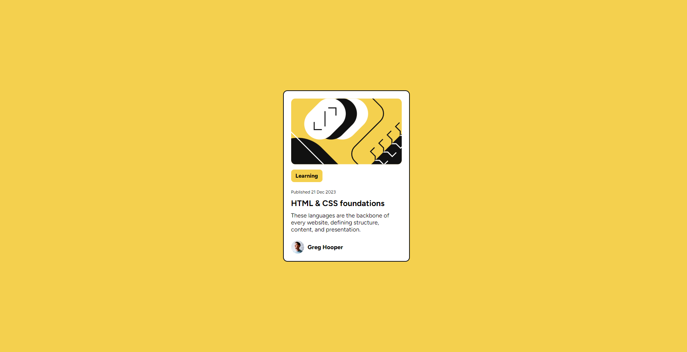
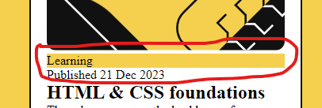

# Frontend Mentor - Blog preview card solution

This is a solution to the [Blog preview card challenge on Frontend Mentor](https://www.frontendmentor.io/challenges/blog-preview-card-ckPaj01IcS). Frontend Mentor challenges help you improve your coding skills by building realistic projects. 

## Table of contents

- [Frontend Mentor - Blog preview card solution](#frontend-mentor---blog-preview-card-solution)
  - [Table of contents](#table-of-contents)
  - [Overview](#overview)
    - [The challenge](#the-challenge)
    - [Screenshot](#screenshot)
    - [Links](#links)
  - [My process](#my-process)
    - [Built with](#built-with)
    - [What I learned](#what-i-learned)
    - [Useful resources](#useful-resources)
  - [Author](#author)

## Overview

### The challenge

Users should be able to:

- See hover and focus states for all interactive elements on the page

### Screenshot



### Links

- [Live Site Version](https://sillyq.github.io/fed-blogcard)


## My process

### Built with

- Semantic HTML5 markup
- CSS custom properties
- Flexbox

### What I learned

- When you're using Flexbox to parent element. The child elements will stretches the width depends on the parent's width and made `info-status` stretch out like an image below :
- 

  Instead of using the parent's `display: flex` property you can use `display: inline-block` for your child element and it will effects only that element like the codes below :

  ```css
  .info-status {
    display: inline-block;
  }
  ```
  Thank you @gracesnow on [Frontend Mentor's Discord](https://discord.gg/frontend-mentor) for help.
- Learning about using CSS selectors in another CSS selector (which is crazy) for changing styles with `:focus`
  ```css
    .card:focus-within {
        .card-container {
            background-color: rgb(204, 204, 204);
        }
    }
  ```
- Learning how to write Markdown (which is the stuff you're reading right now) for explanations.

### Useful resources

- [CSS Froggy](https://www.example.com) - Got suggested from [@pRicard0](https://www.frontendmentor.io/profile/pRicard0). This helped me for learning about alignment in Flexbox as a game so I can enjoy while learning one of the most important thing in CSS
- [Box Shadow Generator](https://cssgenerator.org/box-shadow-css-generator.html) - A site that helps me made the shadow behind the card and reduce the time instead of thinking about it you can visualize how the box-shadow gonna be
- [Flexbox Doc](https://developer.mozilla.org/en-US/docs/Web/CSS/CSS_flexible_box_layout/Aligning_items_in_a_flex_container) - A documentation for Flexbox's references and syntax.

## Author

- Website - [sillyq.github.io](https://sillyq.github.io)
- Frontend Mentor - [@sillyq](https://www.frontendmentor.io/profile/sillyq)
- Twitter - [@qwrrrt_](https://www.twitter.com/qwrrrt_)